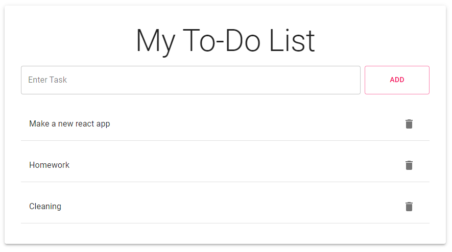

This project was bootstrapped with [Create React App](https://github.com/facebook/create-react-app).

Basic To-Do list app made with React and Material UI. Clone the project and run `npm install` to install all the packages in the package.json file. Run `npm start` to start the server.

